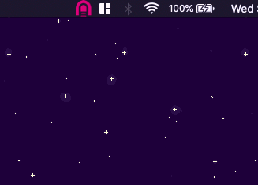

# Colorized TunnelBlick Icons

Colorized versions of the TunnelBlick menu icons from the official Tunnelblick source code repository at [https://github.com/Tunnelblick/Tunnelblick](https://github.com/Tunnelblick/Tunnelblick)

Works best with dark mode.

GIMP template files have been included so other colors can be generated. I may produce other color schemes in the future, and I welcome PRs.

## License

Tunnelblick is released under the terms of the GNU General Public License, version 2.

These modified icons are also released under the terms of the GNU General Public License, version 2. 

## Installation

1. Move the contents of `IconSets/` to `/Library/Application\ Support/TunnelBlick/Shared/IconSets/`
2. (Re)start TunnelBlick
